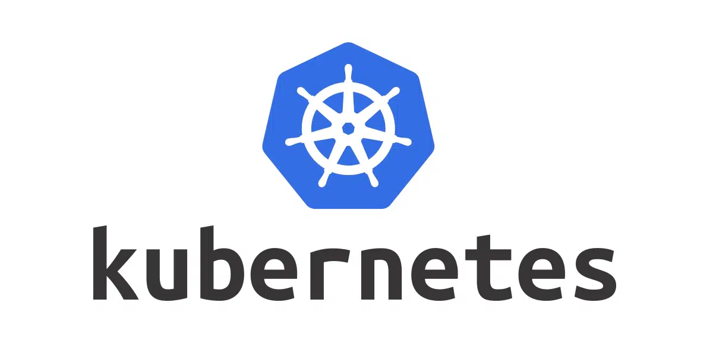

---
# try also 'default' to start simple
theme: default
# random image from a curated Unsplash collection by Anthony
# like them? see https://unsplash.com/collections/94734566/slidev
background: /img/crates.jpg
# apply any windi css classes to the current slide
class: ''
# https://sli.dev/custom/highlighters.html
highlighter: shiki
# show line numbers in code blocks
lineNumbers: true
# some information about the slides, markdown enabled
info: |
  ## Kubernetes Vorstellung
  für das IoS Projekt um PROCEED
# persist drawings in exports and build
drawings:
  persist: false
---

# Kubernetes


Moritz Reich


---
---
# Agenda

1. Container und Docker
1. Skalierung von Containern
1. Kubernetes
    1. Konzept
    1. Bestandteile
    1. Distributionen
    1. Demo
<!-- 1. Exkurs: Knative -->


<!--
You can have `style` tag in markdown to override the style for the current page.
Learn more: https://sli.dev/guide/syntax#embedded-styles
-->

<style>
</style>

---
---
# Container und Docker

<span v-click>

```bash
docker run -p 80:80 nginx
```
</span>


<span v-click>

```bash
❯ docker ps
CONTAINER ID   IMAGE   CREATED          STATUS          PORTS                NAMES
5d542b01ffa4   nginx   5 seconds ago    Up 5 seconds    0.0.0.0:80->80/tcp   eloquent_mirzakhani
```
</span>


<!--
test
-->

---
---
# Container und Docker
Docker Compose


<span v-click>

```yaml
version: "3.9"
services:
  nginx:
    image: nginx
    ports:
      - "80:80"
```
</span>


<span v-click>

```bash
❯ docker-compose up -d
[+] Running 1/1
 ⠿ Container docker-nginx-1  Started

❯ docker ps
CONTAINER ID   IMAGE  CREATED          STATUS          PORTS                NAMES
74f9899170a6   nginx   26 seconds ago   Up 2 seconds    0.0.0.0:80->80/tcp   docker-nginx-1
```
</span>


---
layout: image-right
image: /img/scaling.jpg
---

# Skalierung von Containern

<div class="pt-5"></div>

<div grid="~ cols-2 gap-4">

<div v-click class="text-center">

Vertikal


</div>


<div v-click class="text-center">

Horizontal
</div>

</div>

<div class="pt-5"></div>

<div grid="~ cols-2 gap-4">

<div v-click class="text-center">
Hardware aufstocken
</div>


<div v-click class="text-center">
Mehr Server hinfügen
</div>

</div>


<div class="pt-5" />

<v-click>

**Skalierungmöglichkeiten:**

</v-click>

<v-clicks>

- Docker-Compose
- Docker Swarm
- Apache Mesos

- kommerzielle Varianten der Cloud Platformen

</v-clicks>


---
class: "mx-48 my-36 text-5xl"
---


<pre v-click class="text-center">kubernetes</pre>
<!-- <pre class="text-center">k        s</pre> -->
<pre v-click class="text-center">k<span class="text-gray-400">12345678</span>s</pre>
<pre v-click class="text-center">k8s</pre>

---
---
# Kubernetes


<p class="text-transparent">Test</p>

<div grid="~ cols-2 gap-4">


<div>

<v-click>

bevor es Kubernetes gab:
- mehrere Server mit einzelnen Docker Daemons
- Monitoring, Autoscaling, ... meist nur durch erhebliche Selbstkonfiguration

</v-click>

<div class="pt-5" />

<v-click>

Google BORG
- genutzt zum Skalieren tausender Container
- wollten eine Open Source Lösung, welche vendorunabhängig war
- BORG wurde zu Kubernetes

</v-click>

</div>

<!--  -->

</div>
<!--
Aktualisierung der Docker Daemons musste einzeln geschehen

horizontales skalieren nur durch scripte und watcher

Selbst Docker Swarm bot nicht alle Funktionen an, die Kubernetes zu bieten hat.
Meist nur durch selbstständiges Nachrüsten
-->


---
---
# Kubernetes
Konzept

<div grid="~ cols-2 gap-4">
<div v-click>

- open source
- unabhängig
- Skalieren von Containern über mehrere Server hinweg
- Abstraktion der Container Runtime --> unabhängig von einem Server
- Automatisierung von
    - **Bereitstellung**,
    - **Skalierung** und
    - **Verwaltung**
    der Container

</div>


</div>


---
---
# Kubernetes
Bestandteile


---
---
# Kubernetes
Bestandteile

<v-click>

**Master (Control-Plane)**
- hat Administrationsverantwortung im Cluster
- kümmert sich um die Koordination und Verteilung der Workloads über die verschiedenen Nodes
- kann auch Workloads ausführen

</v-click>

<v-click>

**Node**
- hat einen Namen, eine externe IP und eine interne IP
- ist ein physischer Server bzw. der Kubernetes Agent, welcher auf dem Server läuft
- reiner Arbeitsserver, keinerlei Administrationsmacht im Cluster
- auf einem Node können Workloads laufen

</v-click>

<v-after>

**Hochverfügbarkeit**
- mindestens 3 Master Nodes hinter einem Load Balancer

</v-after>

---
---
# Kubernetes
Bestandteile

**Pod**
- kleinste ausführbare Einheit
- Gruppe ein oder mehrere Container mit gemeinsamen Speicher und Netzwerkressourcen
- ein Pod kann nicht über mehrere Nodes verteilt werden

- *Dockervergleich*:<br />Ein Pod ist eine Gruppe von Docker Containern mit einem gemeinsan Namensraum und Volumes. Ähnlich zu Docker-Compose

- Pods können durch *Workload-Ressourcen* erstellt und verwaltet werden


<!--
Pod: Begriff kommt von
- Erbensschote, weil mehrere Erbsen in einer Schote
- oder Gruppe von Walen
-->

---
---
# Kubernetes
Bestandteile - Workload Ressourcen

<div grid="~ cols-2 gap-4">


<div>

**Deployment**
- beschreibt einen gewünschten Zustand für Pods
- der gewünschte Zustand wird vom Controller mit dem aktuellen verglichen
- durch die Angabe von replicas können Pods einfach skaliert werden

<br />


```bash
kubectl apply -f deployment.yml
```

</div>

<div>

```yaml
apiVersion: apps/v1
kind: Deployment
metadata:
  name: nginx-deployment
  labels:
    app: nginx
spec:
  replicas: 3
  selector:
    matchLabels:
      app: nginx
  template:
    metadata:
      labels:
        app: nginx
    spec:
      containers:
      - name: nginx
        image: nginx:latest
        ports:
        - containerPort: 80
```

</div>

</div>

---
---
# Kubernetes
Bestandteile - Netzwerk


- jeder Pod hat seine eigene IP-Adresse
- jeder Pod kann mit allen Pods auf allen Nodes kommunizieren
- Container in einem Pod teilen sich die Netzwerkressourcen; gleiche IP und MAC Adresse


<v-click>

**Service**

<div grid="~ cols-2 gap-4">


<div>

- Abstraktion um Pods von außerhalb erreichbar zu machen
- mehrere Replicas von Pods können unter einem Service erreichbar gemacht werden
- Services können auch genutzt werden um externe Endpoints (Datenbank) innerhalb des Cluster unter einem Servicenamen verfügbar zu machen

</div>

<div>

```yaml
apiVersion: v1
kind: Service
metadata:
  name: my-service
spec:
  selector:
    app: MyApp
  ports:
    - protocol: TCP
      port: 80
      targetPort: 9376
```

</div>

</div>

</v-click>

<!--
Diese einfache Struktur des Netzwerks soll eine einfache Portierung von VMs auf COntainer ermöglichen

Container in einem Pod: quasi als würden sie auf dem gleichen Server laufen

rechts ist ein Service
- dieser fasst alle Pods zusammen, die den selector app=MyApp haben
- dadurch können andere Pods einfach nur my-service:80 aufrufen und werden von einem dahinterliegenden Pod bedient


verschiedene Arten von Services:
- Standard: ClusterIP -> nur im Cluster verfügbar
- NodePort: Auf allen nodes wird ein Port reserviert, welcher dann an die Pods den Request überträgt
- LoadBalancer: Pods werden unter einer eigenen IP Adresse verfügbar gemacht. Dazu wird meist ein externer Load Balancer genutzt

-->

---
---
# Kubernetes
Bestandteile - Netzwerk

**Ingress**
- ist kein Service
- stellt HTTP und HTTPS Ports nach außen bereit
- übernimmt das Routing von vHosts zu den entsprechenden Pods


<!--
- Beispiel:
    - website1.com und website2.com zeigen beide auf den Server 1.2.3.4
    - beide Seiten sollen unterschiedliche Websiten darstellen, dafür laufen unterschiedliche Pods im Cluster
    - die Pods sind hinter Services verfügbar gemacht
    - der INgress übernimmt das Routing wenn ein Request mit website1.com oder website2.com hereinkommt
-->

---
---
# Kubernetes
Bestandteile - Weitere Ressourcen

**Volumes**
- Stateful Anwendungen
- Permanenter Speicher

**ConfigMaps**
- Konfigurationsdateien
- Tree-Form

**Secrets**
- Api-Keys
- Datenbankzugänge


<!--
Zusätzlich zu den dreien gibt es außerdem die Möglichkeit
Kubernetes um neue Ressourcen zu erweitern durch eigene Definitionen
-->

---
---
# Kubernetes
Distributionen

- Kubernetes (k8s)
- k3s
- k0s
- Charmed Kubernetes
- microk8s
- minikube
- kind
- ...

<div class="block bg-white dark:bg-gray-200 fixed top-0 right-0 w-[65%] h-full">
</div>


<!--
jeder Cloudprovider hat zudem meist seine eigene modifizierte Engine

jede Distribution hat seinen eigenen Anwendungszweck
-->

---
class: "mx-auto my-50 text-center"
---
# Demo


---
---
# Quellen / Weitere Infos
<p />


Kubernetes Docs:<br />
https://kubernetes.io/de/

Kubernetes Alternativen, IONOS:<br />
https://www.ionos.de/digitalguide/server/knowhow/kubernetes-alternativen/

Kubernetes 101 (YT Playlist) von Jeff Gerling, mit Praxisbeispielen:<br />
https://www.youtube.com/playlist?list=PL2_OBreMn7FoYmfx27iSwocotjiikS5BD

The Digital Life (YT Kanal), mit Praxisbeispielen:<br />
https://www.youtube.com/c/TheDigitalLifeTech

Techno Tim (YT Kanal), mit Praxisbeispielen:<br />
https://www.youtube.com/c/TechnoTimLive


**Bildquellen**

Titelbild: https://unsplash.com/photos/tjX_sniNzgQ
Scaling: https://unsplash.com/photos/KxUKuMRtYmI
Kubernetes Logo: https://www.linuxadictos.com/wp-content/uploads/kubernetes-logo.jpg.webp
